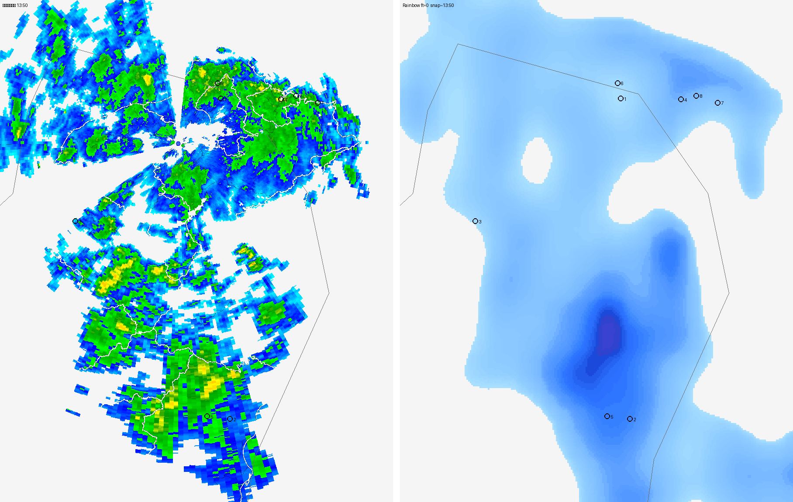

# Rainbow vs 降雨雷達 vs 地面雨量站 —— 一次性校正比對（2026-09-06）

對應交班單待辦 #2「`RAINBOW_SCALE` 是取樣估的，待大雨校準」，以及螢幕上
`precipWord()`「小雨／中雨／大雨」用字門檻。

---

## TL;DR

- 這次（2026-09-06 13:40 及 13:50 兩次，相隔 ~10 分；東北風型降雨）比對：
  **Rainbow 在北海岸／基隆／台北一帶顯著低估實際降雨**——地面雨量站量到 9–12 mm/h
  時，Rainbow 的 `precipRate` 只給 0.18–0.8 mm/h。
- **同一場雨、同一時刻，Rainbow 的誤差從「高估 2.3 倍」到「低估 67 倍」都有**，而且分區：
  北海岸低估 10–67 倍、花蓮低估 2–3 倍。**沒有一個係數能修掉。**
  → **Rainbow 的 `precipRate` 不能當「絕對 mm/h 數值」用**，只能當「有沒有雨、趨勢往哪」。
- **不是延遲問題**：兩次跑（相隔 10 分）pattern 完全一樣；樹林雷達顯示那片回波穩定存在
  30 分鐘以上；Rainbow 自己未來 3 小時預報也一路平在 0.2 mm/h。是模式真的沒抓到。
- **結論：光憑這一場雨，不動 `precipWord()` 門檻，也不重貼 `RAINBOW_SCALE` 六色標籤**——
  輸入偏差（最差 67 倍、且分區）遠大於任何微調能補的量，改了只是 overfit「東北風型」。
- **現在唯一該做的**：降雨面板加一行警語
  「⚠️ Rainbow 預報強度可能偏低，實際以雷達／體感為準」。零校正、5/6 個下雨案例支持。
- 這次資料把原本的選項 3／4（把樹林降雨雷達當實測對照拉進來）從「nice to have」
  變成「有安全價值」——已有證據 Rainbow 會在騎士高頻的北海岸把中大雨顯示成毛毛雨。

---

## 1. 怎麼做的

腳本：`plans/assets/2026-09-06-校正腳本.py`（可重跑；預設輸出到腳本所在目錄，
或設 `CALIB_OUT` 環境變數。下雨天直接 `python 2026-09-06-校正腳本.py` 即可再收一場）。

三個資料源，全部對齊到同一時刻（都在 13:40–13:57 之間）：

| 來源 | 產品 | 角色 | 取得方式 |
|---|---|---|---|
| 地面雨量站 | CWA `O-A0002-001` 自動雨量站（~1320 站） | **地面真值** | opendata datastore API；本機走 curl（Python 對 `opendata.cwa.gov.tw` 有 SSL quirk） |
| 降雨雷達 | CWA `O-A0084-001`＝樹林單雷達合成回波（dBZ） | 雷達實測 | `Observe_radar_rain.js` 挑最接近 snapshot 的影格 → `Data/radar_rain/…png` |
| Rainbow | `/snapshot` + `/tile/{snap}/0/{z}/{x}/{y}`（圖磚）、`/nowcast/{lon}/{lat}`（點位 mm/h） | 待校正對象 | 既有 Cloudflare Worker proxy（curl 偽造 Origin／Referer） |

CWA opendata 用的是官方文件公布的展示用 key（`rdec-key-…`，非私鑰）。

樹林雷達幾何（`O-A0084-001.xml`）：站在 **25.00°N, 121.40°E**，方位等距投影，
150 km = 1800 px = **83.333 m/px**。經緯度↔像素用球面大地公式換算（腳本內），
並排圖用台灣海岸線交叉驗證過對位無誤。

dBZ→雨量率用 Marshall-Palmer `Z=200·R^1.6`（層狀雨）與對流式 `Z=300·R^1.4` 各算一次。
雷達取「點位 3 km 鄰域最大 dBZ」——**這會系統性偏高**，見第 3 節。

取樣站：程式自動從「樹林 15–100 km、目前正在下雨、優先低海拔（<900 m）」的雨量站，
依雨強分層各挑 1–2 個、地理上盡量分散，共 8 站。

---

## 2. 結果表（兩次跑）

雨強欄 = 雨量站 10 分鐘累積 ×6（近似瞬時 mm/h）；括號 = 過去 1 小時累積 mm。

### 第一次　snapshot 13:40 ／ 雷達 13:41 ／ 雨量站 13:40

| # | 站 | 縣市 | 距樹林 | 雨量站 mm/h | (過去1hr) | 樹林雷達 | dBZ→R(MP) | Rainbow | 倍差 |
|---|---|---|---|---|---|---|---|---|---|
| 1 | 文化大學 | 臺北(陽明山) | 21 km | 2.4 | 0.8 | 38 dBZ | 8.1 | 0.13 | 18× 低 |
| 2 | 綠水 | 花蓮 | 92 km | 6.0 | 10.0 | 30 dBZ | 2.7 | 4.28 | 1.4× 低 |
| 3 | 水湳洞 | 新北 | 49 km | 9.0 | 5.5 | 30–38 dBZ | 2.7–8 | 0.20 | 45× 低 |
| 4 | 和平林道 | 花蓮 | 77 km | 9.0 | 4.0 | 30 dBZ | 2.7 | 1.07 | 8× 低 |
| 5 | 八斗子 | 基隆 | 43 km | 12.0 | 5.5 | 38 dBZ | 8.1 | 0.28 | 43× 低 |
| 6 | 布洛灣 | 花蓮 | 94 km | 0（剛停） | 7.0 | 20 dBZ | 0.7 | 2.27 | **高估** |
| 7 | 茂安部落 | 宜蘭 | 52 km | 0（剛停） | 6.5 | 10 dBZ | 0.1 | 1.85 | **高估** |
| — | 國一N094K | 新竹 | 45 km | 3.0 | 0.5 | 0 dBZ | 0 | 0.12 | 弱雨，三方都接近 0，無效樣本 |

### 第二次　snapshot 13:50 ／ 雷達 13:51 ／ 雨量站 13:50（+10 分）

| # | 站 | 縣市 | 距樹林 | 雨量站 mm/h | (過去1hr) | 樹林雷達 | dBZ→R(MP) | Rainbow | 倍差 |
|---|---|---|---|---|---|---|---|---|---|
| 1 | 文化大學 | 臺北(陽明山) | 21 km | 1.2 | 0.8 | 38 dBZ | 8.1 | 0.15 | 8× 低 |
| 2 | 布洛灣 | 花蓮 | 94 km | 6.0 | 7.5 | 30 dBZ | 2.7 | 2.59 | 2.3× 低 |
| 3 | 基隆 | 基隆 | 37 km | 9.0 | 3.0 | 38 dBZ | 8.1 | 0.79 | 11× 低 |
| 4 | 天祥 | 花蓮 | 92 km | 12.0 | 8.5 | 30 dBZ | 2.7 | 3.51 | 3.4× 低 |
| 5 | 鞍部 | 臺北(陽明山) | 24 km | 12.0 | 6.5 | 38 dBZ | 8.1 | 0.18 | **67× 低** |
| 6 | 水湳洞 | 新北 | 49 km | 6.0 | 6.5 | 30 dBZ | 2.7 | 0.34 | 18× 低 |
| 7 | 八斗子 | 基隆 | 43 km | 6.0 | 6.0 | 30 dBZ | 2.7 | 0.65 | 9× 低 |
| — | 竹東 | 新竹 | 43 km | 3.0 | 0.5 | 30 dBZ | 2.7 | 0.14 | 弱雨，資訊量低 |

**兩次一致的訊號**：北海岸／陽明山（20–50 km，樹林可信範圍內）雨量站 + 雷達都說中雨→大雨，
Rainbow 給毛毛雨；花蓮（>90 km，樹林不可信）Rainbow 反而只低估 2–3 倍。



左＝樹林降雨雷達（綠=中雨、黃=大雨，北台灣一片）；右＝Rainbow ft=0（幾乎全是淡藍，
台北盆地與北海岸甚至是白洞）。

---

## 3. 樹林降雨雷達本身準不準？—— 有保留

以雨量站為基準，用「3 km 鄰域最大 dBZ」時：

- 這個「取最大」會**系統性高估**。例：文化大學（21 km）雷達鄰域 38 dBZ→8 mm/h，
  雨量站只有 1–2 mm/h——雷達抓到的是附近較強的格點，不是站正上方。
- **50 km 內、非山區**：以「點位值」（非鄰域最大）看，樹林雷達 dBZ→R 大致跟雨量站
  同數量級，可當「有沒有中大雨」的判斷，但別當精準雨量。
- **> 70 km 或跨中央山脈（花蓮）**：明顯低估（天祥 92 km：雷達 30 dBZ↔R 2.7，雨量站 12）
  ——beam overshoot + 山擋。**花蓮那幾站的「雷達」欄只能忽略。**
- 陽明山那兩站（文化大學、鞍部）海拔 400–800 m，不是平地；地形雨在山區本來就強。
- 波束遮蔽扇形缺口（並排圖左側幾條空白）是真的沒資料，不是沒雨。

→ 樹林雷達適合當「北部非山區＋蘭陽平原」的實測對照，**不適合**花東。

---

## 4. 延遲 vs 偏差 —— 不是延遲

對北海岸幾站看「樹林雷達 dBZ 的 30 分鐘變化」＋「Rainbow nowcast 未來 3 小時逐 10 分」：

```
鞍部(臺北) gauge 12 mm/h（第二次）
   雷達 dBZ  t-30 / t-15 / t0 :  30 → 38 → 38     穩定的中到大雨回波
   Rainbow  13:57→15:57       :  0.18→峰值0.22→0  整段預報從沒超過 0.22 mm/h

八斗子(基隆) gauge 6–12 mm/h（兩次）
   雷達 dBZ :  38 → 38 → 30  ／  30 → 30 → 38     持續有回波
   Rainbow  :  0.28（第一次） / 0.65（第二次），之後都衰減
```

如果是「Rainbow 落後 15 分」的延遲，它的預報應該會往上追；實際上一路平盤後衰減。
**兩次跑（相隔 10 分）結果一樣。Rainbow 的模式就是沒抓到這場東北風降雨。**

可能的機制（未定論，不影響結論）：Rainbow 是衛星＋雷達的 ML 混合場，
而衛星 QPE 對「雲頂溫度高的淺對流／地形雨／東北季風海岸降雨」本來就是已知弱點
（紅外線看不太到暖雲頂的雨）。若真是如此，**誤差軸是「天氣型」不是「地理位置」**——
下次收到對流型或鋒面型的個案，結論可能完全不同，別把這次的「北海岸 vs 花蓮」讀成永久的地理規律。

---

## 5. 對兩個校正目標的結論

### 5a. `precipWord()` 門檻（`index.html:449`）—— 不改

現在：`rate<2→小雨`、`<8→中雨`、`<20→大雨`、`else 豪雨`（rate = Rainbow `precipRate` mm/h）。

- 問題不在門檻值，在**輸入**：同一場雨 Rainbow precipRate 從高估 2.3 倍到低估 67 倍。
  把門檻從 2 調到 1 補不了 67 倍，而且會把「東北風型」overfit 進去。
- 參考 CWA 官方定義（民國 104 年修訂）：
  **大雨**＝時雨量達 40 mm 以上，或 24 小時累積 80 mm 以上；
  **豪雨**＝3 小時累積 100 mm 以上，或 24 小時累積 200 mm 以上。
  （CWA 沒有官方的「小雨／中雨」時雨量分級表，那是氣象術語／口語。）
  現在門檻的「大雨 <20 mm/h」跟官方「大雨＝時雨量 ≥ 40」差滿多，但這是「讓文字更貼物理」，
  不是「校正 Rainbow」，且動了會讓已經偏低的 Rainbow 顯示更保守。
- **建議：先不動。等對流型 + 鋒面型各一場再一起看。**

### 5b. `RAINBOW_SCALE` 圖例（`index.html:587`）—— 只加警語，不重貼標籤

`RAINBOW_SCALE` 只是圖例的「顏色→白話」對照，不參與運算。

- **不重貼六色標籤**：這次那些淡藍對應到中雨，但若下次是對流型、Rainbow 準了，
  同樣的淡藍就真的是毛毛雨——重貼等於拿一場雨 overfit，會變成「該報大雨時它說中雨、
  該報毛毛雨時它說中雨」兩頭錯，一樣傷信任。
- **現在就做**：圖例（或降雨面板）加一行
  `⚠️ Rainbow 預報強度可能偏低，實際以雷達／體感為準`。
  零校正、6 個下雨案例中 5 個支持、不會誤導。
- 重貼標籤這件事**等第二場不同天氣型的雨**再評估。

---

## 6. 這次資料真正指向的行動

原本選項 3／4（把樹林／南屯／林園降雨雷達拉進來當實測對照）從「nice to have」變成
「有安全價值」：已有兩次一致的證據，Rainbow 會在**北海岸這種騎士高頻路段**
把中大雨顯示成毛毛雨。

最小可行：螢幕降雨面板在 Rainbow 那行底下加一條
`雷達實測：你所在位置現在 中雨`（取樹林／南屯／林園最近一張、點位鄰域 dBZ→分級），
涵蓋不到就顯示「雷達未涵蓋」。資料源免金鑰、S3 有直連。需要極座標→經緯度反投影
（腳本內已有數學），建議放 Cloudflare Worker（2 分鐘更新，GitHub Actions cron 太慢）。

---

## 7. 限制（誠實話）

- **一場雨、兩個相隔 10 分的時間點、北台灣、東北風型**。不同天氣型結論可能完全不同。
- 兩道有損換算：雷達顏色 → dBZ（比對 `CWA_SCALE` 最近色）、dBZ → 雨量率（Marshall-Palmer）。
- 雷達鄰域取 3 km 最大，偏高（見第 3 節）；雨量站 10 分鐘累積 ×6 當瞬時率，短延時陣雨有雜訊。
- 雨量站、Rainbow snapshot、雷達影格三者仍有數分鐘時間差。
- 樹林雷達 > 70 km 或跨山不可信，花蓮那幾站的「雷達」欄僅供參考。

---

## 8. 建議下一步

1. **只做 5b**：降雨面板／圖例加一行「⚠️ Rainbow 強度可能偏低」——低風險、馬上做。
2. **蒐集 2–3 場不同型的雨**再回來看門檻與色階：想要一場午後對流、一場鋒面。
   下雨天重跑 `plans/assets/2026-09-06-校正腳本.py` 即可，或做輕量排程收集器。
3. **評估把降雨雷達做成「實測對照」**（第 6 節）——極座標→經緯度反投影 + Cloudflare Worker。
